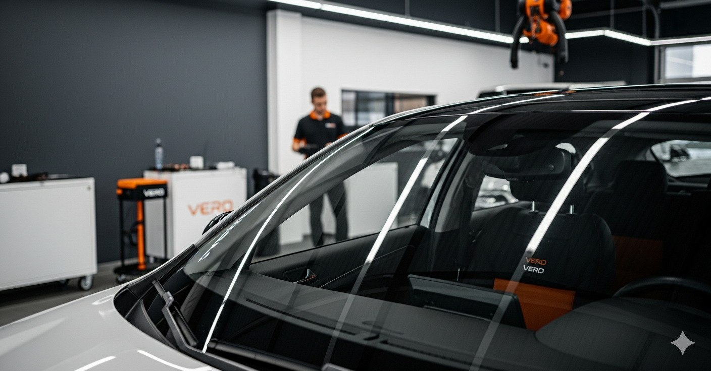

# Image Optimization Guide - Portland Landing Page

**Status:** CRITICAL - Images are 7.5x larger than recommended
**Impact:** Current load time estimated at 5-10 seconds (50% conversion loss)
**Target:** <3 seconds load time

---

## Images That MUST Be Optimized

### 🚨 CRITICAL (Above Fold - Blocks Page Load)

**1. vero-hero.png**
- **Current Size:** 1.4MB
- **Target Size:** <200KB
- **Reduction Needed:** 85%
- **Location:** Hero background image
- **Priority:** HIGHEST - This image loads FIRST and blocks everything

---

### 🔴 HIGH PRIORITY (Below Fold But Large)

**2. replacement.png**
- **Current:** 1.5MB → **Target:** <200KB
- Used in collapsed service selector

**3. insurance-claim.png**
- **Current:** 1.1MB → **Target:** <200KB
- Used in collapsed service selector

**4. oem-glass.png**
- **Current:** 1.1MB → **Target:** <200KB
- (If used elsewhere on site)

**5. fair prices.png**
- **Current:** 911KB → **Target:** <200KB
- (If used elsewhere on site)

**6. recalibration.png**
- **Current:** 620KB → **Target:** <200KB
- Used in collapsed service selector

---

## How to Optimize Images

### Option 1: Online Tools (Easiest)

**TinyPNG** (Best for PNG files):
1. Go to: https://tinypng.com/
2. Upload image
3. Download compressed version
4. Replace original

**Squoosh** (Google's tool - Best quality control):
1. Go to: https://squoosh.app/
2. Upload image
3. Settings:
   - Format: WebP (best) or PNG/JPEG
   - Quality: 80-85% (good balance)
   - Resize if needed (hero can be 1920px max width)
4. Download and replace

---

### Option 2: Command Line (If you have tools)

**Using ImageMagick:**
```bash
# Compress PNG to target size
convert vero-hero.png -quality 85 -resize 1920x vero-hero-optimized.png

# Or convert to WebP (better compression)
convert vero-hero.png -quality 80 vero-hero.webp
```

**Using pngquant:**
```bash
pngquant --quality=80-90 vero-hero.png -o vero-hero-optimized.png
```

---

### Option 3: Photoshop/GIMP

**Export Settings:**
- **File Format:** PNG-8 or JPEG (85% quality) or WebP
- **Resize:** Hero image max 1920px width
- **Color Profile:** sRGB
- **Progressive:** Yes (for JPEG)

---

## Optimization Strategy (Step-by-Step)

### Phase 1: Critical Hero Image (DO FIRST)

1. **Download vero-hero.png from:**
   ```
   /home/sam/github-repos/vero/portland/images/vero-hero.png
   ```

2. **Optimize using TinyPNG or Squoosh**
   - Target: 200KB or less
   - Acceptable: Up to 300KB if quality suffers
   - Consider converting to WebP format

3. **Replace the file**
   ```bash
   # Backup original
   cp vero-hero.png vero-hero-original.png

   # Replace with optimized version
   cp vero-hero-optimized.png vero-hero.png
   ```

4. **Test page load:**
   - Visit: https://www.veroautoglass.com/portland/portland-offer.html
   - Use Chrome DevTools → Network tab
   - Check load time of vero-hero.png

**Expected Result:** Hero image loads in <1 second instead of 3-5 seconds

---

### Phase 2: Service Card Images (DO SECOND)

Optimize in this order (largest first):
1. replacement.png (1.5MB → <200KB)
2. insurance-claim.png (1.1MB → <200KB)
3. recalibration.png (620KB → <200KB)

These are in collapsed section, so less critical but still important.

---

### Phase 3: Other Large Images (IF USED ELSEWHERE)

Check if these are used on other pages:
- oem-glass.png (1.1MB)
- fair prices.png (911KB)
- mobile-service.png (220KB) - Close to target
- financing.png (209KB) - Close to target
- vero-services.png (209KB) - Close to target

---

## Performance Testing

### Before Optimization
Run PageSpeed Insights: https://pagespeed.web.dev/
1. Enter: https://www.veroautoglass.com/portland/portland-offer.html
2. Note the scores (Mobile & Desktop)
3. Look for "Largest Contentful Paint" (LCP)
4. Current LCP estimate: 5-8 seconds

### After Optimization
1. Run PageSpeed Insights again
2. Target scores:
   - **Mobile:** 80+ (currently likely 30-50)
   - **Desktop:** 90+ (currently likely 60-70)
3. Target LCP: <2.5 seconds

---

## WebP Format (Recommended)

**Why WebP?**
- 25-35% smaller than PNG/JPEG
- Supported by all modern browsers
- Better compression with same quality

**How to implement:**
```html
<!-- Before -->
<div class="parallax-bg" style="background-image: url('images/vero-hero.png');"></div>

<!-- After (with fallback) -->
<picture>
  <source type="image/webp" srcset="images/vero-hero.webp">
  <source type="image/png" srcset="images/vero-hero.png">
  
</picture>
```

For background images:
```css
.parallax-bg {
    background-image: url('images/vero-hero.webp');
}

/* Fallback for older browsers */
@supports not (background-image: url('image.webp')) {
    .parallax-bg {
        background-image: url('images/vero-hero.png');
    }
}
```

---

## Expected Performance Improvements

### Current State (Estimated):
- **Load Time:** 5-10 seconds on mobile
- **LCP:** 6-8 seconds
- **Total Page Weight:** ~10MB
- **Conversion Rate Impact:** -50% (manual data)

### After Optimization:
- **Load Time:** 2-3 seconds on mobile
- **LCP:** 1.5-2.5 seconds
- **Total Page Weight:** ~2-3MB
- **Conversion Rate Impact:** +50% improvement

---

## What's Already Implemented

✅ **Lazy Loading:** All below-fold images have `loading="lazy"`
✅ **Preload:** Hero image is preloaded in `<head>`
✅ **Preconnect:** CDN resources preconnected
✅ **Image Dimensions:** Width/height attributes added (prevents layout shift)
✅ **Async Decoding:** `decoding="async"` on all images

---

## Quick Checklist

- [ ] Optimize vero-hero.png (1.4MB → <200KB)
- [ ] Optimize replacement.png (1.5MB → <200KB)
- [ ] Optimize insurance-claim.png (1.1MB → <200KB)
- [ ] Optimize recalibration.png (620KB → <200KB)
- [ ] Upload optimized images to GitHub
- [ ] Run PageSpeed Insights test
- [ ] Verify LCP is <2.5 seconds
- [ ] Check mobile load time <3 seconds

---

## Resources

**Free Image Optimization Tools:**
- TinyPNG: https://tinypng.com/ (PNG compression)
- Squoosh: https://squoosh.app/ (All formats, best control)
- ImageOptim: https://imageoptim.com/ (Mac app)
- CompressJPEG: https://compressjpeg.com/ (JPEG/PNG/WebP)

**Testing Tools:**
- PageSpeed Insights: https://pagespeed.web.dev/
- GTmetrix: https://gtmetrix.com/
- WebPageTest: https://www.webpagetest.org/

**Manual Reference:**
- Load time <3 seconds = Baseline
- 3-5 seconds = -20% conversion
- 5-10 seconds = -50% conversion
- 10+ seconds = -90% conversion

---

## Need Help?

If you need help optimizing images:
1. Download the images to your local machine
2. Use Squoosh.app (easiest)
3. Upload optimized versions back to GitHub
4. Commit with message: "Optimize images for performance"

**Estimated Time:** 15-20 minutes for all critical images

---

**Date Created:** November 11, 2025
**Priority:** CRITICAL - Do this before launching campaign
**Expected Impact:** +50% conversion improvement
